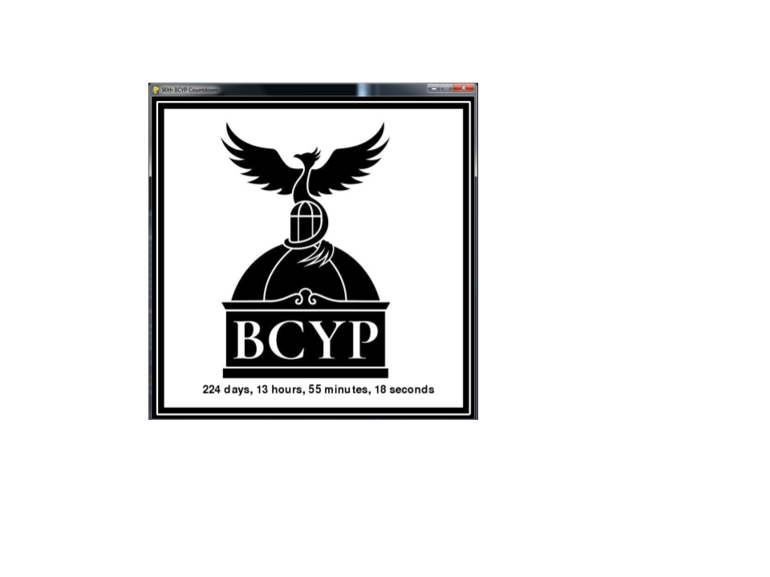

# BCYP-Countdown
PyGame program written to count down to the next session of the British Columbia Youth Parliament

<p align="center">
  
</p>

### Prerequisites
```
- Python 2.7 or 3
- PyGame module
```

### Features
<ul>
  <li>Bitmapped background image</li>
  <li>Countdown in days, hours, and seconds</li>
</ul>

### Usage
```
python BCYP-Counter.py
```
```
./BCYP-Counter.py
```
### Author
* **Rebecca Louie** - - (https://github.com/rebecca-louie)

PyGame program to count down to the next session of the British Columbia Youth Parliament

### Author

* **Rebecca Louie** - - (https://github.com/rebecca-louie)
